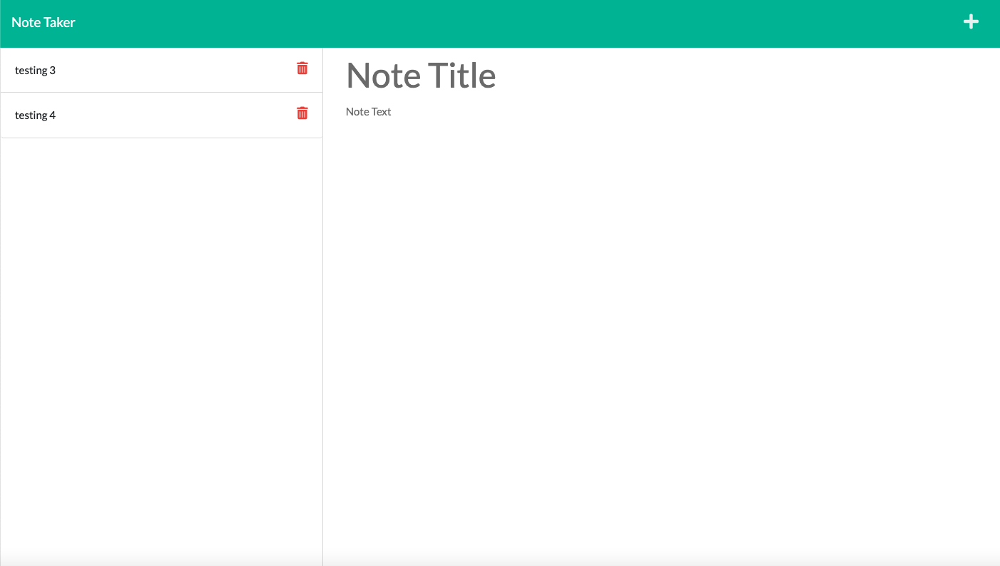
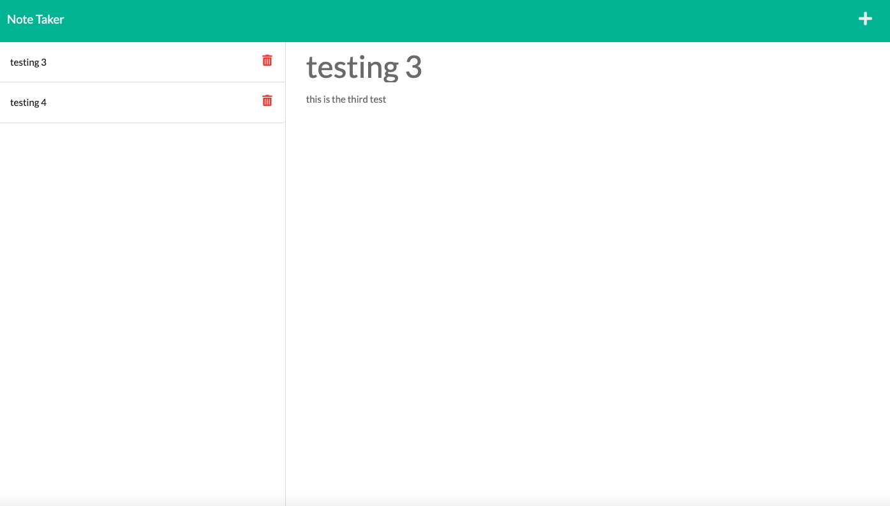

# Note-Taker

## Links

Github Repo: https://github.com/SamiF812/Note-Taker

Heroku: 

## Description

A note taking app, that combines front end and back end development with the use of routing. The app allows you to create a new note, save the note and add it to a database, then you can easily recall the notes by clicking on them. 

## Future Development

Get the delete button to work